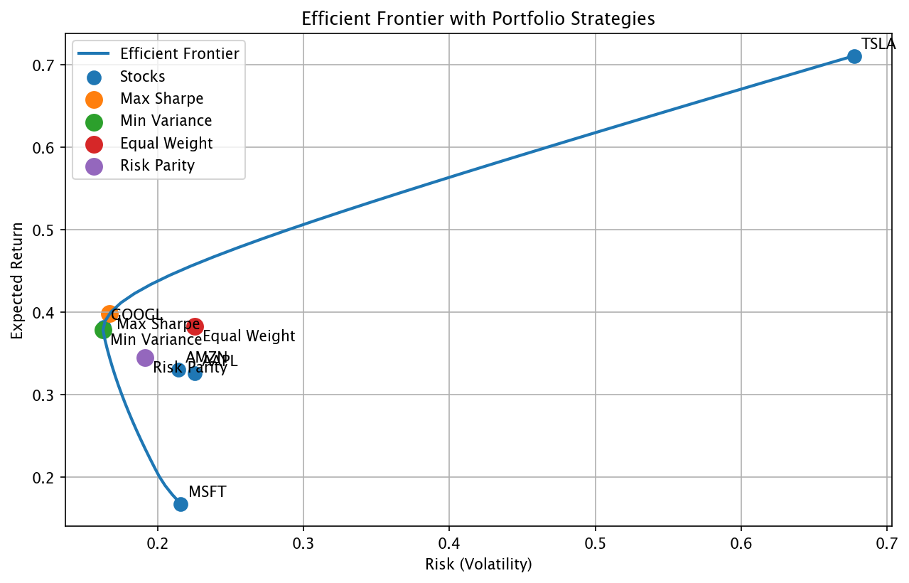
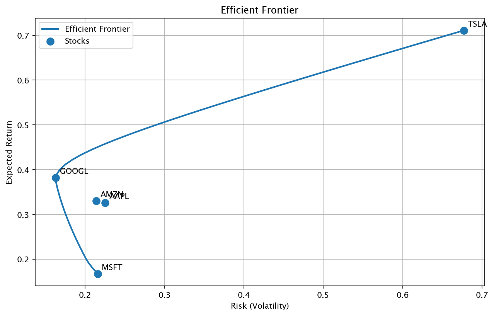
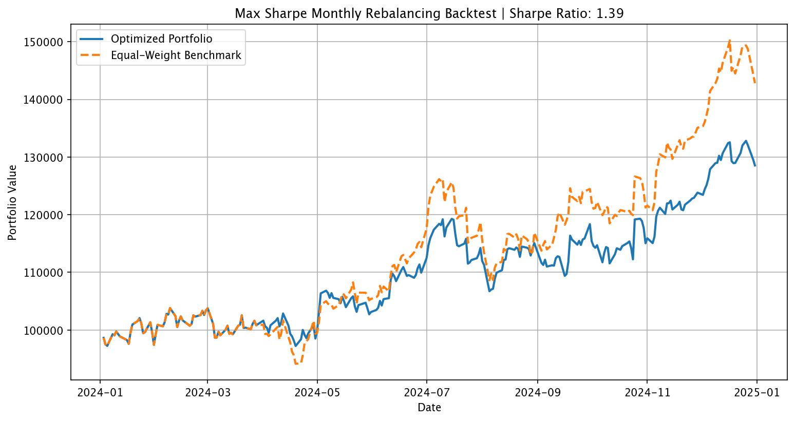
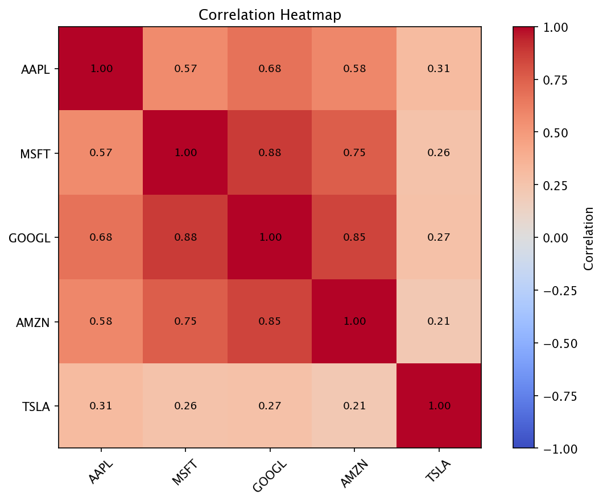
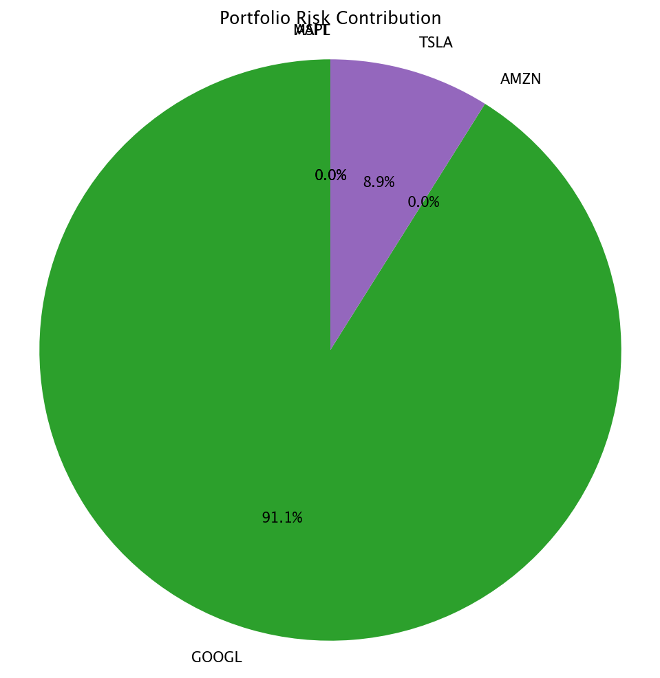

# Portfolio Optimiser

[](https://www.python.org/downloads/)
[](https://opensource.org/licenses/MIT)
[](https://github.com/psf/black)

A professional-grade portfolio optimization system built in Python, implementing modern portfolio theory with practical constraints, transaction costs, backtesting, and risk attribution.

<p align="center">
  
</p>

## 🎯 Overview

This project demonstrates quantitative portfolio management techniques used at hedge funds and asset managers:

- **Efficient Frontier Construction** — Mean-variance optimization using SLSQP
- **Multiple Portfolio Strategies** — Max Sharpe, Min Variance, Equal Weight, Risk Parity
- **Real-World Constraints** — Position limits, sector exposure caps
- **Transaction Cost Modeling** — Commission, spread costs, minimum trade sizes
- **Walk-Forward Backtesting** — Monthly rebalancing with look-ahead bias prevention
- **Risk Attribution** — Decompose portfolio risk by asset, measure diversification

## 📁 Project Structure

```
portfolio_optimiser/
├── __init__.py          # Package exports
├── data_loader.py       # Price data loading, returns, covariance
├── optimizer.py         # Portfolio optimization strategies
├── constraints.py       # Weight and sector constraints
├── costs.py             # Transaction cost modeling
├── backtester.py        # Walk-forward backtesting engine
└── report.py            # Risk attribution and visualization

tests/
├── test_optimizer.py    # Efficient frontier tests
├── test_constraints.py  # Constraint tests
├── test_costs.py        # Transaction cost tests
├── test_backtester.py   # Backtest tests
├── test_report.py       # Risk attribution tests
└── test_strategies.py   # Strategy comparison tests

data/
└── sample_price_data.csv

outputs/                 # Generated visualizations
├── efficient_frontier.png
├── frontier_with_strategies.png
├── constrained_vs_unconstrained.png
├── backtest.png
├── portfolio_risk_contribution.png
└── correlation_heatmap.png
```

## 🚀 Quick Start

### Prerequisites

- Python 3.10 or higher
- pip package manager

### Installation

```bash
# Clone the repository
git clone https://github.com/Patience-Fuglo/portfolio-optimiser.git
cd portfolio-optimiser

# Create virtual environment (recommended)
python -m venv .venv
source .venv/bin/activate  # On Windows: .venv\Scripts\activate

# Install dependencies
pip install -r requirements.txt
```

### Run Full Analysis

```bash
python main.py
```

This will:
1. Load sample price data for 5 tech stocks
2. Compare 4 portfolio strategies (Max Sharpe, Min Variance, Equal Weight, Risk Parity)
3. Run a walk-forward backtest with monthly rebalancing
4. Generate risk attribution analysis
5. Save all visualizations to `outputs/`

### Run Individual Tests

```bash
python tests/test_optimizer.py      # Efficient frontier
python tests/test_constraints.py    # Constrained vs unconstrained
python tests/test_strategies.py     # Strategy comparison
python tests/test_costs.py          # Transaction cost model
python tests/test_backtester.py     # Backtest with costs
python tests/test_report.py         # Risk attribution
```
## 📊 Sample Visualizations

<table>
  <tr>
    <td></td>
    <td></td>
  </tr>
  <tr>
    <td></td>
    <td></td>
  </tr>
</table>

## 📊 Key Features

### 1. Efficient Frontier
Constructs the efficient frontier by minimizing portfolio volatility for each target return level using scipy's SLSQP optimizer.

### 2. Portfolio Strategies
| Strategy | Description |
|----------|-------------|
| **Max Sharpe** | Maximize risk-adjusted return |
| **Min Variance** | Minimize total portfolio volatility |
| **Equal Weight** | Simple 1/N allocation benchmark |
| **Risk Parity** | Equalize risk contribution across assets |

### 3. Constraints
- Per-asset weight bounds (e.g., max 30% per stock)
- Sector exposure limits (e.g., max 70% in Tech)
- Prevents extreme concentration from unconstrained optimization

### 4. Transaction Costs
- Commission rate (e.g., 0.10%)
- Bid-ask spread cost (e.g., 0.05%)
- Minimum commission per trade
- Net return calculation after costs

### 5. Backtesting
- Walk-forward methodology (no look-ahead bias)
- Monthly rebalancing using trailing 60-day returns
- Transaction cost deduction on each rebalance
- Comparison against equal-weight buy-and-hold benchmark

### 6. Risk Attribution
- Asset-level risk contribution decomposition
- Diversification ratio measurement
- Correlation heatmap visualization
- Risk concentration analysis

## 📈 Sample Results

### Strategy Comparison
```
Strategy        Return   Volatility   Sharpe
Max Sharpe      0.3981       0.1670   2.2643
Min Variance    0.2856       0.1423   1.8675
Equal Weight    0.3833       0.2392   1.5188
Risk Parity     0.3245       0.1856   1.6392
```

### Risk Attribution (Max Sharpe Portfolio)
```
Asset      Weight   Exp Return   Volatility   Risk %
GOOGL      0.9512       0.3820       0.1629   91.08%
TSLA       0.0488       0.7111       0.6773    8.92%

Diversification Ratio: 1.1255
```

## 🧠 Key Insights

### Concentration Risk
Unconstrained max-Sharpe optimization produces extreme allocations (95%+ in single assets). This demonstrates why real portfolios require:
- Position limits
- Diversification constraints
- Regularization techniques

### Diversification Benefit
A diversification ratio > 1.0 indicates that correlation structure is reducing portfolio risk below the weighted average of individual asset volatilities.

## 🔧 Configuration

### Backtest Parameters
```python
backtester = PortfolioBacktester(
    optimizer_func=max_sharpe_ratio,
    rebalance_months=1,        # Monthly rebalancing
    cost_model=cost_model,     # Transaction costs
    starting_value=100000,     # Initial capital
    risk_free_rate=0.02,       # 2% annual
    lookback_days=60,          # Trailing window
)
```

### Constraint Parameters
```python
constraints = PortfolioConstraints(
    max_weight=0.30,           # Max 30% per asset
    min_weight=0.00,           # No minimum
    sector_limits={"Tech": 0.70}
)
```

## 📚 Technical Details

### Optimization Method
- **Algorithm**: Sequential Least Squares Programming (SLSQP)
- **Constraints**: Equality (weights sum to 1) + inequality (bounds, sectors)
- **Objective**: Minimize volatility or negative Sharpe ratio

### Risk Contribution Formula
```
RC_i = w_i × (Σ × w)_i / σ_portfolio
```

Where:
- `w_i` = weight of asset i
- `Σ` = covariance matrix
- `σ_portfolio` = portfolio volatility

### Diversification Ratio
```
DR = Σ(w_i × σ_i) / σ_portfolio
```

A ratio > 1 indicates diversification benefit from imperfect correlations.

## 🎓 Skills Demonstrated

This project demonstrates proficiency in:

| Category | Technologies/Concepts |
|----------|----------------------|
| **Quantitative Finance** | Modern Portfolio Theory, Mean-Variance Optimization, Risk Attribution |
| **Mathematical Optimization** | Constrained Optimization, SLSQP, Convex Optimization |
| **Data Analysis** | Time Series Analysis, Statistical Modeling, Covariance Estimation |
| **Software Engineering** | Modular Design, Type Hints, Documentation, Testing |
| **Python Libraries** | NumPy, Pandas, SciPy, Matplotlib |

## 📝 Future Enhancements

- [ ] Live data integration (yfinance, Alpha Vantage)
- [ ] Factor-based risk models (Fama-French)
- [ ] Black-Litterman model for incorporating views
- [ ] Robust covariance estimation (Ledoit-Wolf shrinkage)
- [ ] Interactive dashboard (Streamlit/Dash)
- [ ] Multi-period optimization with rebalancing costs
- [ ] Monte Carlo simulation for stress testing
- [ ] Performance attribution analysis

## 🤝 Contributing

Contributions are welcome! Please feel free to submit a Pull Request. For major changes, please open an issue first to discuss what you would like to change.

1. Fork the repository
2. Create your feature branch (`git checkout -b feature/AmazingFeature`)
3. Commit your changes (`git commit -m 'Add some AmazingFeature'`)
4. Push to the branch (`git push origin feature/AmazingFeature`)
5. Open a Pull Request

## 📄 License

This project is licensed under the MIT License - see the [LICENSE](LICENSE) file for details.

## 👤 Author

**Patience Fuglo**

- GitHub: [@Patience-Fuglo](https://github.com/Patience-Fuglo)
- LinkedIn: [Patience Fuglo](https://www.linkedin.com/in/patience-fuglo/)

---

<p align="center">
  <i>Built as a quantitative finance portfolio project demonstrating end-to-end portfolio optimization infrastructure.</i>
</p>
